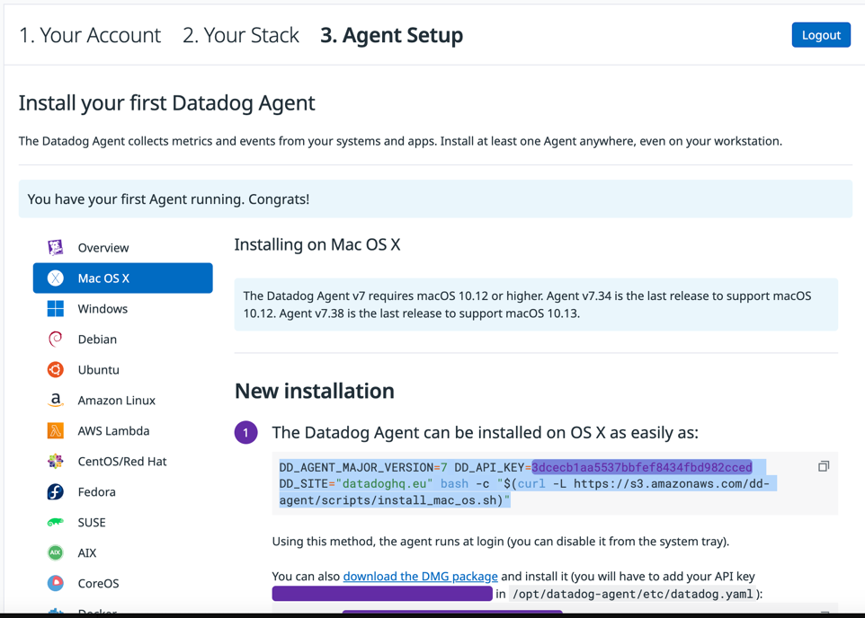

# Spring WebFlux and Datadog Getting Started

### Spring WebFlux Application Setup

1. Create a Java application with the dependencies

```groovy
// Replaces spring-boot-starter-web
// Note: webmvc needs to be excluded from dependencies if migrating to webflux
implementation 'org.springframework.boot:spring-boot-starter-webflux'

// To have non-blocking input/output when querying the database
implementation 'org.springframework.boot:spring-boot-starter-data-mongodb-reactive'

// For integration testing a spring boot application 
testImplementation 'org.springframework.boot:spring-boot-starter-test'

// For reactive stream testing (which is be backbone of Webflux)
testImplementation 'io.projectreactor:reactor-test'

// Templating language for webpage (Note: JSPs don't work with webflux)
implementation 'org.springframework.boot:spring-boot-starter-thymeleaf'
```

#### Example of the WebFlux Messenger UI 


### Datadog Installation

1. Sign up with your Google Account.
2. Run the following command in your terminal (if you're on Mac OS):
```
DD_AGENT_MAJOR_VERSION=7 DD_API_KEY=<key> DD_SITE="datadoghq.eu" bash -c "$(curl -L https://s3.amazonaws.com/dd-agent/scripts/install_mac_os.sh)"
```


3. Modify `datadog.yaml` file located at `.datadog-agent/datadog.yaml`.
   1. Uncomment and set `site: datadoghq.eu`.
   2. Uncomment and set `logs_enabled: true`.

6. Restart the Datadog agent by running the following command:
```
launchctl stop com.datadoghq.agent
launchctl start com.datadoghq.agent
```

### Datadog Instrumentation

1. Add `-javaagent:/Users/<user>/dd-java-agent.jar` to your VM options.
2. Add ` -Ddd.service=webmvc-messenger` to your VM arguments to set the service name.
2. Started the Spring boot, and you'll likely see:
```
[dd.trace 2023-10-09 12:58:33:544 +0100] [dd-task-scheduler] INFO datadog.trace.agent.core.StatusLogger - DATADOG TRACER CONFIGURATION {...
```

### Datadog Error Tracking

1. Added dependency to enable error tracking
```groovy
implementation 'io.opentracing:opentracing-util:0.33.0'
```
2. Datadog requires manual instrumentation for [APM Error Tracking](https://docs.datadoghq.com/tracing/trace_collection/custom_instrumentation/java/#set-errors-on-a-span)
```java
var ex = new RuntimeException("'a' can't equal 'b'");

final Span span = GlobalTracer.get().activeSpan();

if (span != null) {
    span.setTag(Tags.ERROR, true);
    span.log(Collections.singletonMap(Fields.ERROR_OBJECT, ex));
}
```


### Datadog Alert Setup

1. This is my configuration for an Error Tracking Alert

```json
{
  "id": 13274911,
  "name": "High number of errors in WebFlux Messenger",
  "type": "error-tracking alert",
  "query": "error-tracking-traces(\"resource_name:\\\"GET /messages-between\\\"\").rollup(\"count\").by(\"@issue.id\").last(\"5m\") > 5",
  "message": "High number of errors on [issue](https://app.datadoghq.eu/apm/error-tracking/issue/{{[issue.id].name}}) detected.\n\n{{#is_alert}}\n```\n{{span.error.type}}: {{span.attributes.error.message}}\n```\n{{/is_alert}} @junior.owolabi@hippodigital.co.uk",
  "tags": [
    "team:rapid-response",
    "webflux_error"
  ],
  "options": {
    "thresholds": {
      "critical": 5,
      "warning": 3,
      "critical_recovery": 1,
      "warning_recovery": 2
    },
    "enable_logs_sample": false,
    "notify_audit": false,
    "restriction_query": null,
    "on_missing_data": "default",
    "include_tags": true,
    "new_host_delay": 300,
    "groupby_simple_monitor": false,
    "silenced": {}
  },
  "priority": 1,
  "restricted_roles": null
}
```

#### Example of when an alert is triggered


#### Example of the alert email


Let me know if you have any other questions.